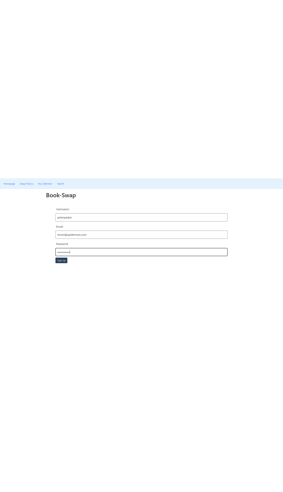

# Book-Swap

## Intro
The Book Swap website is an online book listing service. Users can sign up, login, search for books that they own to put into their collection, offer them to other users, or take from other's collections. Books taken from collections are logged onto a transaction history page.

## Technologies Used
- Axios to run google books' API on the backend
- Sequelize to automate our SQL database
- Expressjs to run the server
- ExpressHandlebars to handle webpage rendering and navigation
- Render to host the website

## Usage
- Visit the LiveURL provided below
- Register providing valid email, username, and password
- Search for books that you have and add them
- Browse other's collections for books you may want
- Click the 'Exchange' button to add that user's book to your collection
- Users can delete books from their collection if they don't want to trade it at the moment

## Live URLs
[Live URL](https://book-swap-ro94.onrender.com/)\
[Github Repo](https://github.com/aharper2568/Book-Swap)

## Screenshots

## Authors

**[Bryson Shoffner](https://github.com/Bryson987081)\
[Megan Zimnicki](https://github.com/meg-an321)\
[Nariman Suleimenov](https://github.com/NarSulEsz)\
[Anthony Harper](https://github.com/aharper2568)**

